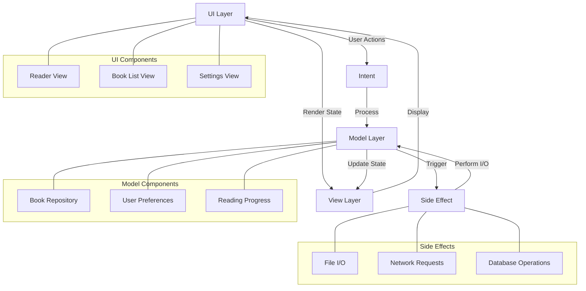
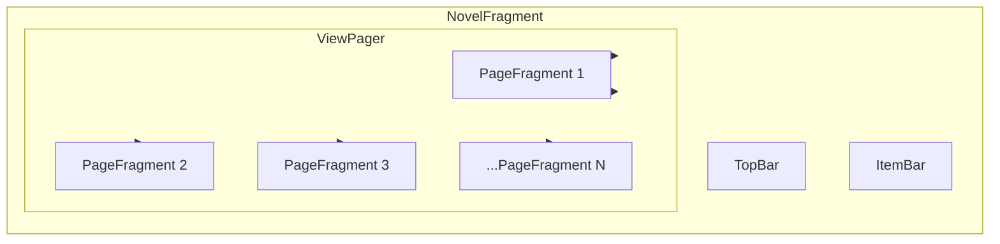

# 小说阅读App

Tags: SoftWare
AI custom autofill: This document outlines the development plan for a novel reading app.

## 1. 项目概述

### 目标：

制作一款小说阅读软件，类似番茄小说，可实现小说阅读，主要来自txt文件导入，或者爬取笔趣阁的小说内容，UI页面仿番茄小说，可调节字体大小，阅读时实现黑夜白天模式（背景深色浅色）。

### 技术栈：

1.  **编程语言**
    
    **Kotlin**：近年来官方推荐的开发语言，简洁、现代化，与Java互操作性强。
    
2.  **Android SDK 和框架**
    - **Android SDK**：提供开发Android应用的基础API和工具，包含各类UI组件、后台服务和硬件交互等。
    - **Android Jetpack**：谷歌推出的组件库集合，帮助开发者构建高质量应用。包含多个库：
        - **Lifecycle**：管理Activity和Fragment的生命周期。
        - **Navigation**：简化页面导航。
        - **Flow**：响应式数据持有者，支持UI和数据的实时绑定。
        - **ViewModel**：存储与UI相关的数据，帮助保持数据的独立性和持久性。
        - **Room**：提供本地数据库访问，简化数据库操作。
    - **Material Design**：一组UI设计规范和组件库，让应用外观和交互符合Google的设计标准。
3. **构建工具**
    - **Gradle**：Android的主要构建工具，支持依赖管理、代码编译、打包等任务。
4. **数据持久化**
    - **SQLite**：Android内置的轻量级关系数据库，适合本地数据存储。
    - **Room**：官方推荐的SQLite封装库，提供更简化的数据库操作和ORM（对象关系映射）支持。
5. **网络请求**
    - **Retrofit**：适用于REST API的网络请求库，支持异步请求、文件上传、序列化等。
    - **OkHttp**：强大的HTTP客户端，Retrofit底层依赖的网络库。
6. **依赖注入**
    - **Dagger** 和 **Hilt**：Dagger是Google提供的依赖注入框架，Hilt是对Dagger的简化封装，更适合Android开发。
7. **响应式编程**
    - **Kotlin Coroutines**：Kotlin提供的协程库，简化了异步代码的编写，是处理并发任务的官方推荐方式。
8. **图像加载与处理**
    - **Glide**：图像加载库，提供缓存管理和高效的图像处理。
    - **Coil**：Kotlin开发的图像加载库，支持异步加载和协程。
9. **测试框架**
    - **JUnit**：最常用的单元测试框架。
    - **Espresso**：UI测试框架，支持模拟用户交互。
    - **Mockito**：用于模拟对象的测试库，适合单元测试和集成测试。
10. **开发工具**
    - **Android Studio**：官方推荐的集成开发环境（IDE），支持代码编辑、调试、模拟器、测试等多种开发需求。
    - **ADB（Android Debug Bridge）**：用于连接、调试设备的命令行工具。
    - **Android Emulator**：Android Studio自带的模拟器，可以模拟各种设备和系统环境。

## 2. 需求分析

### 2.1 用户需求

- **用户角色**：主要的用户群体，如小说爱好者。
- **用户痛点**：描述用户当前面临的问题，例如：阅读小说过程中体验差，无法调整阅读模式等。
- **目标解决方案**：设计的功能如何满足用户需求，提升用户体验。

### 2.2 功能需求

### 基本功能

- **小说导入**：
    - [ ]  从本地导入 `.txt` 文件。
    - [ ]  支持从网站（如笔趣阁）获取小说内容并导入。
- **小说阅读**：
    - [x]  支持阅读页面的左右翻页。
    - [ ]  章节目录显示及快速跳转。
    - [ ]  可设置自动滚动或手动翻页。

### 界面功能

- **UI界面**：
    - [ ]  首页展示阅读记录、已导入的小说列表。
    - [ ]  小说详情页，展示封面、简介、作者信息等。
    - [ ]  阅读界面支持仿番茄小说的阅读模式。
- **自定义阅读设置**：
    - [ ]  字体大小、字体颜色调节。
    - [ ]  白天模式和夜间模式切换（背景深色浅色）。
    - [ ]  行间距、边距调整。

### 辅助功能

- [ ]  **书签功能**：支持在阅读时添加书签，便于下次继续阅读。
- [ ]  **阅读进度保存**：自动记录阅读进度，下次打开自动跳转。
- **搜索**：
    - [ ]  支持全局搜索小说。
    - [ ]  支持小说章节内容中的关键字搜索。

### 2.3 性能需求

- [ ]  **加载速度**：大文件（如几百章节的小说）能够快速加载并解析。
- [ ]  **缓存优化**：保存网络小说的章节数据以减少多次请求。
- [ ]  **内存优化**：对图像、数据进行优化，减少内存占用，提升阅读流畅度。

### 2.4 系统需求

- **兼容性**：
    - [ ]  支持主流Android版本（API 27及以上）。
    - [ ]  优化适配不同屏幕尺寸的Android设备。
- **安全性**：
    - [ ]  权限请求仅限于必须的存储和网络访问。
    - [ ]  网络小说爬取具备基础的反爬和请求频率控制。

### 2.5 非功能性需求

- **可扩展性**：代码模块化设计，便于未来功能扩展（如支持更多的小说源）。
- **用户体验**：UI设计符合Material Design标准，简洁易用。
- **稳定性**：系统在长时间阅读或反复操作情况下保持稳定。
- **可维护性**：代码结构清晰，具备详细的注释和文档，便于后续维护。
- **多语言支持**：未来可扩展为支持多种语言（如中文、英文）。

### 2.6 风险分析

- **数据安全**：需考虑爬取的小说资源是否侵犯版权问题。
- **兼容性问题**：不同Android版本、不同品牌设备的显示与性能问题。
- **网络稳定性**：加载网络小说可能受网络波动影响，需考虑离线缓存策略。
- **资源占用**：持续加载图像及小说章节，可能引发内存溢出，需进行资源释放与优化。

## 3. 设计

### 架构图：



### UI设计：

- 书架
    
    
    

- 阅读页面


- 工具栏


**阅读页面UI架构：**



## 4. 代码记录

### 关键点1：滑动翻页与点击翻页

实现翻页功能使用 `ViewPager2`，但其仅支持滑动翻页。为此，增加点击事件，**将屏幕分为三部分**，以便实现以下功能：

- 左侧区域点击：向左翻页
- 中间区域点击：呼出工具栏
- 右侧区域点击：向右翻页

**初步实现方案**：

- 在同一页面内添加三个 `View` 用以捕捉点击事件。
- 问题：`ViewPager2` 无法实现滑动翻页。

**优化方案**：

- 提高 `ViewPager2` 的视图高度，使 `ViewPager2` 能实现滑动翻页。
- 问题：`View` 无法响应点击事件。

**最终方案**：

- 自定义一个视图，位于 `ViewPager2` 之上。
    - **点击事件**：自定义视图自行处理。
    - **滑动事件**：向下传递给 `ViewPager2`。

**代码实现：**

```kotlin
import android.content.Context
import android.util.AttributeSet
import android.util.Log
import android.view.MotionEvent
import android.widget.FrameLayout

class NovelFrameLayout @JvmOverloads constructor(
    context: Context,
    attrs: AttributeSet? = null,
    var clickList: List<() -> Unit> = listOf({}, {}, {})
) : FrameLayout(context, attrs) {
    private var isSingleTap = 0

    override fun dispatchTouchEvent(ev: MotionEvent?): Boolean {
        return super.dispatchTouchEvent(ev)
    }

    override fun onInterceptTouchEvent(ev: MotionEvent?): Boolean {
        ev?.let {
            when (it.action) {
                MotionEvent.ACTION_DOWN -> {

                }
                MotionEvent.ACTION_MOVE -> {
                    // 如果有移动，则不是单击
                    isSingleTap = -1
                }
                MotionEvent.ACTION_UP -> {
                    // 在UP时，如果仍然认为是单击，则拦截事件
                    isSingleTap ++
                    if (isSingleTap == 1) {
                        val screenWidth = width
                        val x = it.x

                        when {
                            x < screenWidth / 3 -> {
                                // 点击在左侧
                                clickList[0]()
                            }
                            x < 2 * screenWidth / 3 -> {
                                // 点击在中间
                                clickList[1]()
                            }
                            else -> {
                                // 点击在右侧
                                clickList[2]()
                            }
                        }
                        isSingleTap = 0
                        return true
                    }
                }
            }
        }
        return false
    }

    override fun onTouchEvent(event: MotionEvent?): Boolean {
        Log.d("TAG", "onTouchEvent: handle")
        event?.let {
        }
        isSingleTap = 0
        return true
    }
}
```

**代码结构与逻辑解析**

1. **构造函数**
    
    ```kotlin
    class NovelFrameLayout @JvmOverloads constructor(
        context: Context,
        attrs: AttributeSet? = null,
        var clickList: List<() -> Unit> = listOf({}, {}, {})
    ) : FrameLayout(context, attrs)
    
    ```
    
    - 该类继承自 `FrameLayout`，并通过 `@JvmOverloads` 注解支持多重构造函数。
    - `clickList` 是一个包含三个 `lambda` 函数的列表，用于分别处理左、中、右区域的点击事件，默认为空操作 `{}`。
2. **成员变量 `isSingleTap`**
    
    ```kotlin
    private var isSingleTap = 0
    ```
    
    - `isSingleTap` 用于标识是否为单击事件，初始值为 `0`。通过对 `isSingleTap` 值的变更，可以区分单击、移动、抬起等事件。
    - `isSingleTap == 1` 时认为是单击。
3. **事件分发 `dispatchTouchEvent`**
    
    ```kotlin
    override fun dispatchTouchEvent(ev: MotionEvent?): Boolean {
        return super.dispatchTouchEvent(ev)
    }
    ```
    
    - 重写 `dispatchTouchEvent` 方法，当前未作任何改动，调用父类方法即可。
4. **事件拦截 `onInterceptTouchEvent`**
    
    ```kotlin
    override fun onInterceptTouchEvent(ev: MotionEvent?): Boolean {
        ev?.let {
            when (it.action) {
                MotionEvent.ACTION_DOWN -> {
                    // 按下时，初始化单击状态
                }
                MotionEvent.ACTION_MOVE -> {
                    // 如果有移动，则不是单击
                    isSingleTap = -1
                }
                MotionEvent.ACTION_UP -> {
                    // 在UP时，如果仍然认为是单击，则拦截事件
                    isSingleTap++
                    if (isSingleTap == 1) {
                        val screenWidth = width
                        val x = it.x
    
                        when {
                            x < screenWidth / 3 -> {
                                // 点击在左侧
                                clickList[0]()
                            }
                            x < 2 * screenWidth / 3 -> {
                                // 点击在中间
                                clickList[1]()
                            }
                            else -> {
                                // 点击在右侧
                                clickList[2]()
                            }
                        }
                        isSingleTap = 0
                        return true
                    }
                }
            }
        }
        return false
    }
    
    ```
    
    - `onInterceptTouchEvent` 用于判断是否拦截事件。逻辑如下：
        - **`ACTION_DOWN`**：事件按下时初始化点击状态。
        - **`ACTION_MOVE`**：检测到移动，则将 `isSingleTap` 置为 `-1`，表示不是单击。
        - **`ACTION_UP`**：当事件抬起时，将`isSingleTap`加一如果 `isSingleTap` 值为 `1`，则视为单击事件，并根据点击的 `x` 位置判断点击区域：
            - 若 `x < screenWidth / 3`，则点击左侧，执行 `clickList[0]`。
            - 若 `x < 2 * screenWidth / 3`，则点击中间，执行 `clickList[1]`。
            - 否则，点击右侧，执行 `clickList[2]`。
        - 每次单击事件处理完成后，将 `isSingleTap` 重置为 `0` 并返回 `true`，拦截事件。
5. **处理触摸事件 `onTouchEvent`**
    
    ```kotlin
    override fun onTouchEvent(event: MotionEvent?): Boolean {
        Log.d("TAG", "onTouchEvent: handle")
        isSingleTap = 0
        return true
    }
    
    ```
    
    - `onTouchEvent` 方法最终处理触摸事件，将 `isSingleTap` 置为 `0`。

### Android中的事件分发

安卓的事件分发机制主要通过三种方法来实现：`dispatchTouchEvent`、`onInterceptTouchEvent` 和 `onTouchEvent`。

1. **`dispatchTouchEvent`**：每个触摸事件（如按下、移动、抬起）首先传递给 `dispatchTouchEvent` 方法。系统从顶层父容器开始调用 `dispatchTouchEvent`，依次向下传递事件。如果返回 `true`，表示事件被当前控件处理，不再向下分发；否则继续向子控件传递。
2. **`onInterceptTouchEvent`**：此方法用于父容器判断是否拦截子控件的触摸事件。若返回 `true`，表示父容器拦截事件并停止传递，子控件不再接收该事件；若返回 `false`，则事件继续传递给子控件处理。
3. **`onTouchEvent`**：当事件未被拦截并传递到具体的控件时，调用 `onTouchEvent` 处理具体的点击、滑动等事件。返回 `true` 表示当前控件处理了该事件，不再继续传递；返回 `false` 时，事件将传递给上层视图处理。

事件分发的整个流程从 `dispatchTouchEvent` 开始，通过 `onInterceptTouchEvent` 判断是否拦截，最终由 `onTouchEvent` 处理。

### 关键点二：小说文本的分页

**需求描述：**

为了在阅读器中实现小说文本的分页显示，需要将小说内容按页面进行分割，使用户在不同页面逐步阅读完整个章节内容。

**实现方案：**

1. **初始化章节页面：**
    - 对于每个章节，将其完整内容初始放入一个页面中。
    - 以此为基础，逐步检测该页面的文本内容，以适配屏幕可展示的文本量。
2. **分页逻辑：**
    - 根据屏幕上能够显示的文本量，计算可容纳的字符或段落数量。
    - 将适合当前页面的文本截取下来，放入当前的 `Fragment`。
    - 对剩余未显示的文本内容重复上述操作，生成新的页面 `Fragment`，直到该章节内容被全部分配到多个页面。
3. **实现 `Fragment` 列表：**
    - 将每个 `Fragment`（包含当前页面文本内容）加入到一个 `Fragment` 列表中。
    - 利用 `ViewPager` 显示 `Fragment` 列表，从而实现章节的逐页展示。

**代码实现：**

1. 首先获取某一页实际能显示的行数（工具类）
    
    ```kotlin
    fun getPageLineCount(view: TextView): Int {
            /*
            * The first row's height is different from other row.
            */
            val h = view.bottom - view.top - view.paddingTop - view.paddingBottom
            val firstH = getLineHeight(0, view)
            val otherH = getLineHeight(1, view)
            println("firstH: $firstH otherH: $otherH h: $h")
            val lineHeight = view.paint.fontMetricsInt.bottom - view.paint.fontMetricsInt.top
            println(lineHeight)
            var lines = 1
            if (otherH != 0) lines = (h - firstH + (otherH - lineHeight)) / otherH + 1 //仅一行时返回1
            return lines
        }
    
        //获取某一行的行高
        private fun getLineHeight(line: Int, view: TextView): Int {
            val rect = Rect()
            view.getLineBounds(line, rect)
            return rect.bottom - rect.top
        }
    ```
    
2. 页面状态及用户意图
    
    ```kotlin
    @Serializable
    data class BookState(
        val title: String = "",//小说标题
        val bookId: Int = 0,//书籍编号
        val author: String = "",//作者
        val brief:String = "",//摘要
        val currentIndex: Int = 0,//目前页面页数
        val showBar: Boolean = false,//是否展示工具栏
        val pageCount: MutableList<Int> = mutableListOf(),//每一章节页数
        val pages: MutableList<PageState> = mutableListOf()//每一页状态
    )
    
    @Serializable
    data class PageState(
        val chapterIndex:Int = 1,//章节
        val title:String = "",//章节标题
        val text:String = "",//该页内容
        val load:Boolean = false//是否已加载，防止重新调用分页逻辑
    )
    
    sealed class BookIntent {
        data object ShowBar: BookIntent()//显示工具栏状态栏
    
        data class Init(val bookBrief: BookBrief) : BookIntent()//初始化书籍信息
    
        data class SetContent(val pages:MutableList<PageState>):BookIntent()//初始化章节
    
        data class AddPage(val insertIndex:Int, val splitTextIndex:Int):BookIntent()//分页
    
        data class SetCurrentIndex(val index:Int):BookIntent()//更改当前页面
    
    }
    
    data class BookBrief(
        val title: String = "",
        val bookId: Int = 0,
        val author: String = "",
        val brief : String = ""
    )
    ```
    
3. Adpter设置
    
    ```kotlin
    class PageFragmentAdapter(fragment: Fragment, viewModel: NovelFragmentViewModel) :
        FragmentStateAdapter(fragment) {
    
        private var pages: MutableList<PageState> = mutableListOf()
    
        init {
            viewModel.state.onEach { state ->
                updateData(state.pages,state.currentIndex+1)
            }.launchIn(fragment.viewLifecycleOwner.lifecycleScope) // 使用 viewLifecycleOwner 的作用域
        }
    
        override fun getItemCount(): Int {
            return pages.size
        }
    
        override fun createFragment(position: Int): Fragment {
            return PageFragment.newInstance(pages[position],position)
        }
    
        private fun updateData(newPage:MutableList<PageState>,insertIndex:Int){
            if (pages == newPage) return
            pages = newPage
            notifyItemInserted(insertIndex)
            notifyItemRangeChanged(insertIndex,pages.size-insertIndex+1)
        }
    }
    ```
    
    这里主要是观察 `ViewModel` 中的 `pages` 这个状态是每一页的文本。当其发生变化的会通知 `Adpter` 更新其数据源。需要注意的点是 `notifyItemInserted` 之后需要 `notifyItemRangeChanged` 才可以成功更新数据源。
    
4. 每一页的 `Fragment` 
    
    ```kotlin
    private const val TITLE = "title"
    private const val TEXT = "text"
    private const val LOAD = "load"
    private const val INDEX = "pageIndex"
    private const val CHAPTER = "chapterIndex"
    
    class PageFragment : Fragment() {
        // TODO: Rename and change types of parameters
        private var text: String? = ""
        private var load: Boolean = false
        private var title:String? = ""
        private var pageIndex:Int = 0
        private var chapterIndex:Int = 0
        private lateinit var sharedViewModel: NovelFragmentViewModel
    
        override fun onCreate(savedInstanceState: Bundle?) {
            super.onCreate(savedInstanceState)
            sharedViewModel =
                ViewModelProvider(requireParentFragment())[NovelFragmentViewModel::class.java]
            arguments?.let {
                title = it.getString(TITLE)
                text = it.getString(TEXT)
                load = it.getBoolean(LOAD)
                pageIndex = it.getInt(INDEX)
            }
        }
    
        override fun onCreateView(
            inflater: LayoutInflater, container: ViewGroup?,
            savedInstanceState: Bundle?
        ): View? {
    
            return inflater.inflate(R.layout.fragment_page, container, false)
        }
    
        override fun onViewCreated(view: View, savedInstanceState: Bundle?) {
            super.onViewCreated(view, savedInstanceState)
            Log.d("TAG", "onViewCreated:")
            val binding = FragmentPageBinding.bind(view)
            val novelText = binding.novelText
            val constraintSet = ConstraintSet()
            constraintSet.clone(binding.root)
            viewLifecycleOwner.lifecycleScope.launch {
                repeatOnLifecycle(Lifecycle.State.STARTED){
                    sharedViewModel.state.collectLatest{
                        val page = it.pages[pageIndex]
                        load = page.load
                        title = page.title
                        chapterIndex = page.chapterIndex
                        if (page.text != text){
                            text = page.text
                            binding.title.text = title
                            novelText.text = text
                        }
                        if (title == ""){
                            binding.title.visibility = View.GONE
                            constraintSet.connect(binding.novelText.id,ConstraintSet.TOP,binding.topic.id,ConstraintSet.BOTTOM)
                        }else{
                            binding.title.post {
                                binding.title.text = title
                            }
                        }
                        novelText.post {
                            val example = text
                            // 获取 Paint 对象以测量字符宽度
                            novelText.text = example
                            if (load)
                                return@post
                            var pageLines = SizeUtils.getPageLineCount(novelText)
                            println(pageLines)
                            val layout= novelText.layout
                            val maxLines = layout.lineCount
                            if (maxLines <= pageLines) {
                                novelText.text = example
                                return@post
                            }
                            println(layout.lineCount)
                            var lineEndOffset = layout.getLineEnd(pageLines-1)
                            val textShowInPage = example?.substring(0,lineEndOffset)
                            var nextStartLine = pageLines - 1
                            pageLines ++
                            var nextEndLine = nextStartLine + pageLines
                            novelText.text = textShowInPage
                            val pageList = mutableListOf(PageState(chapterIndex = chapterIndex,title = title?:"",text = textShowInPage?:"",load = true))
                            while (lineEndOffset < example?.length!!){
                                if (nextEndLine > layout.lineCount-1){
                                    val nextLineEndOffset = layout.getLineEnd(layout.lineCount-1)
                                    val nextTextShowInPage = example.substring(lineEndOffset,nextLineEndOffset)
                                    println("lastPage  $nextTextShowInPage")
                                    pageList.add(PageState(chapterIndex = chapterIndex,title = "",text = nextTextShowInPage,load = true))
                                    break
                                }
                                else {
                                    val nextLineEndOffset = layout.getLineEnd(nextEndLine)
    
                                    val nextTextShowInPage =
                                        example.substring(lineEndOffset, nextLineEndOffset)
                                    pageList.add(
                                        PageState(
                                            chapterIndex = chapterIndex,
                                            title = "",
                                            text = nextTextShowInPage,
                                            load = true
                                        )
                                    )
                                    lineEndOffset = nextLineEndOffset
                                    nextEndLine += pageLines
                                }
                            }
                            sharedViewModel.sendIntent(BookIntent.AddPages(pageList))
                        }
                    }
                }
            }
        }
    
        companion object {
            @JvmStatic
            fun newInstance(pageState: PageState,pageIndex:Int) =
                PageFragment().apply {
                    arguments = Bundle().apply {
                        putString(TITLE, pageState.title)
                        putString(TEXT, pageState.text)
                        putBoolean(LOAD,pageState.load)
                        putInt(INDEX,pageIndex)
                        putInt(CHAPTER,pageState.chapterIndex)
                    }
                }
        }
    }
    ```
    
    在这个 `PageFragment` 中，实现了对小说文本内容分页的逻辑，先将所有文本放到这一页，然后获取一页最多能多少行，依次将其分页
    
5. 分页函数
    
    ```kotlin
    is BookIntent.AddPages -> {
        val pagesCount = _state.value.pageCount
        val newList = _state.value.pages.toMutableList()
        var o = 0
        _state.value.pageCount.run {
           forEachIndexed { index, i ->
               println("$index $i")
                if (index < intent.pageState[0].chapterIndex) {
                    o += i
                } else {
                    return@run
                }
            }
        }
        pagesCount.replaceOrAddUntilToIndex(intent.pageState[0].chapterIndex,intent.pageState.size)
        newList[o] = intent.pageState[0]
        newList.addAll(o+1, intent.pageState.subList(1, intent.pageState.size))
        _state.value = _state.value.copy(pages = newList, pageCount = pagesCount)
    }
    
    fun MutableList<Int>.replaceOrAddUntilToIndex(index: Int, element: Int) {
        if (index < size) {
            this[index] = element
        } else {
            while (index > size) {
                add(0)
            }
            add(element)
        }
    }
    ```
    

## 5. 问题与解决方案

### 问题1：更改 `ViewPager` 数据源时无法正确通知

- 问题信息：在插入多个章节时，由于分页位置不在数据源末尾，所以会导致后面页面的数据绑定出问题
- 原因分析：未通知 `ViewPager` 数据源发生改变
- 解决方案：调用方法
    
    ```kotlin
    notifyItemInserted(insertIndex)
    notifyItemRangeChanged(insertIndex,pages.size-insertIndex)
    ```
    

### 问题2：更改约束之后视图 `visibility` 异常

- 问题信息：在更改书架页面的约束时，进入删除模式应该显出删除顶部栏但未显示
- 原因分析：更改约束之后视图的可见度会变为默认
- 解决方案：在更改视图约束之后再取改变可见度
    
    ```kotlin
    if(it.isDeleteMode) {
        Log.d("TAG", "onViewCreated: deleteMode")
        constraintSet.connect(
            bookShelf.id,
            ConstraintSet.TOP,
            deleteBar.id,
            ConstraintSet.BOTTOM
        )
        constraintSet.applyTo(binding.root)
        deleteBar.visibility = View.VISIBLE
    }
    ```
    

## 6. 总结

- 项目完成总结：
- 收获与改进：
